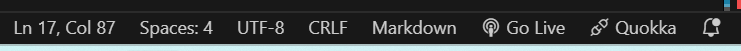

# Comicapp
## Proyecto de desarrollo de PP-II

### Correr el servidor del backend
Luego de descargado o clonado el proyecto se debe ingresar a la ruta comicapp/backend desde la consola.
Se escribe en la terminal el comando node server.js
```sh
cd comicapp
cd backend
node server.js
Servidor corriendo en http://localhost:3000
```
Esto mostrará el mensaje: `Servidor corriendo en http://localhost:3000`

### Correr el servidor del frontend (opcional)
- En el editor de código [Visual Studio Code] Ingresar a **Extensions** y habilitar **Live Server**
- En la barra inferior, luego de correr el servidor del backend, presionar **Go Live**
